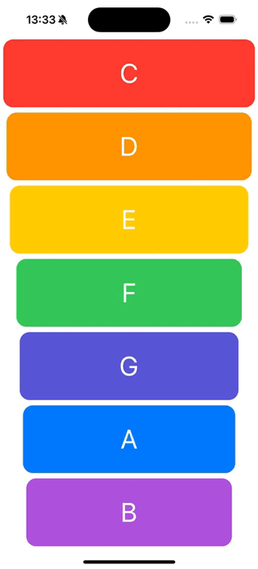

#  Xylophone Swift App

## What was do in this app

First musical instrument in application - colourful XyloPhone.

## What was used to make this app

* The Swift Programming Language
* Storyboard
* AVFoundation and AVAudioPlayer.
* Autolayout for UI elements
* Swift loops

## Example what the application do

